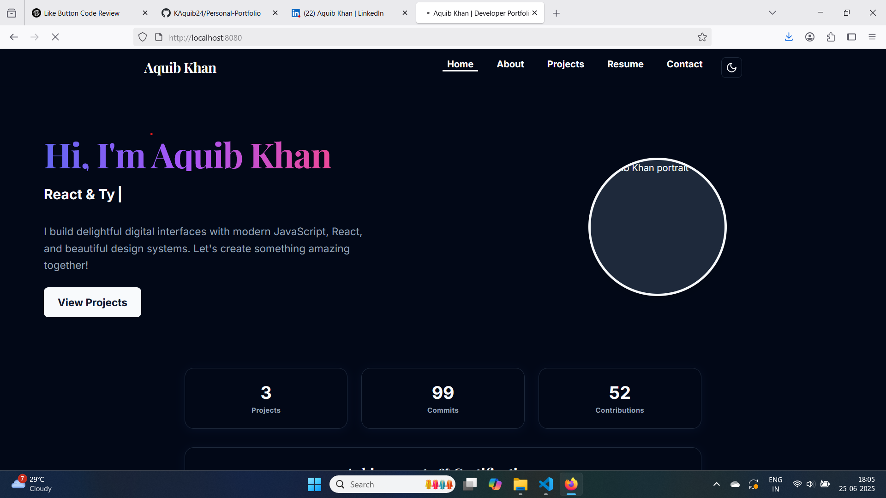

````markdown
# 🌐 Personal Portfolio - Aquib Khan

Welcome to my **Personal Portfolio Website**, a modern, fully responsive site built to showcase my skills, projects, and experience as a Frontend Developer.

 <!-- Replace with actual path -->

---

## 🚀 Features

- 🧑‍💻 **About Me** section with career goals and tech stack
- 🛠️ **Projects Showcase** with live previews and GitHub links
- 📄 **Resume Download** option
- ✉️ **Contact Form** (via EmailJS or custom backend)
- 🌙 **Dark Mode** toggle
- 📱 **Responsive Design** for all devices
- ⚡ **Smooth Animations** using Framer Motion / GSAP

---

## 🛠️ Tech Stack

| Tech           | Purpose                          |
|----------------|----------------------------------|
| **React**      | UI library                       |
| **TypeScript** | Type-safe component development  |
| **Tailwind CSS** | Fast and responsive styling    |
| **React Router** | Page navigation                |
| **Framer Motion** | Animations                    |
| **Shadcn**    | Styling Library    |
| **Vite/CRA**   | Fast bundling and dev server     |


---

## 🔧 Local Setup

```bash
# Clone the repository
git clone https://github.com/KAquib24/Personal-Portfolio.git
cd your-portfolio

# Install dependencies
npm install

# Run development server
npm start 

---

## 📬 Contact

Feel free to connect with me on:

* [LinkedIn](https://www.linkedin.com/in/khan-aquib/)
* [Email](mailto:aquibkhan8108@gmail.com)

